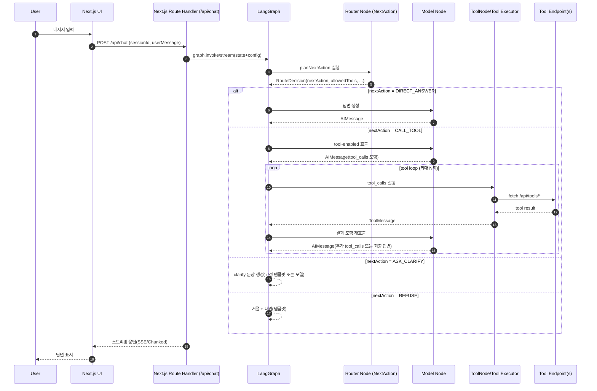

# Next.js + LangGraph 기반 최소 오케스트레이션 MVP PRD

## Executive summary

본 MVP는 **Next.js(풀스택)**와 **LangGraph(상태 기반 그래프 오케스트레이션)**를 이용해, “사용자 입력 → 라우터(NextAction) 결정 → (필요 시) 도구 호출(tool call) → 응답”의 **최소 오케스트레이션**을 시연하는 챗봇을 구현한다. 핵심은 **의도(Intent) 분류 자체가 아니라, 매 턴에 실행할 ‘다음 행동(NextAction)’을 구조화해 결정**하고, 그 결정에 따라 **허용된 도구만 노출/실행**하는 안전한 루프를 제공하는 것이다. LangGraph는 장기 실행·상태·루프·분기 등을 노드/엣지로 명시해 **오케스트레이터를 코드로 유지보수 가능하게 만드는 목적**에 적합하며, 체크포인터 기반의 내장 영속성(threads/checkpoints)도 확장 옵션으로 제공한다. citeturn4view2turn4view3turn0search4

MVP 범위는 다음으로 제한한다.

- 세션별 **Master Context(과제 분석 내용)**이 존재하며, 세션 생성 시 서버에 저장되어 매 턴 참조된다(가정).
- NextAction은 4가지만 지원: `DIRECT_ANSWER`, `CALL_TOOL`, `ASK_CLARIFY`, `REFUSE`.
- 도구는 2개만 제공: (1) `search`(간단한 R&D 검색/근거 카드), (2) `transform`(입력 텍스트 포맷 변환).
- 프런트는 단일 채팅 화면 + 스트리밍 응답 UI.
- 제공 모델/클라우드/인증 방식은 **미정(옵션 제시)**이며, 문서/근거는 공식 문서를 우선한다. citeturn1search11turn2search9turn0search3

## Goals & success metrics

**제품 목표**

- 최소 오케스트레이터의 “결정 → 집행” 구조를 시연한다: 라우터는 구조화된 NextAction을 만들고, 실행은 서버가 통제한다. citeturn0search3turn3search1
- 도구 호출 환경에서 **툴 스키마(입력 계약)**와 **허용 도구 allowlist**를 통해, 모델이 임의로 위험한 실행을 하지 못하도록 보장한다(“모델은 툴 호출 파라미터를 제안하고, 앱이 실행”). citeturn0search3turn2search17turn3search1
- 운영 가능한 최소 기준(로그/트레이스/비용/오류)을 포함한다. LangGraph는 LangSmith 연동을 통해 트레이스 기반 디버깅/관측을 지원한다. citeturn4view0turn4view2

**성공 지표(정량)**

- 라우팅 정확도(내부 평가셋 기준):  
  - `CALL_TOOL`이 필요한 요청에서 도구 호출 경로 진입 비율 ≥ 85%  
  - `DIRECT_ANSWER`가 가능한 요청에서 불필요한 도구 호출 비율 ≤ 10%  
  (구조화 출력/툴 호출 패턴은 도구 호출 신뢰성을 높이는 권장 접근이다.) citeturn3search1turn0search9
- 응답 지연(체감): p95 “첫 토큰/첫 청크”까지 ≤ 1.5초(스트리밍 기준). 스트리밍은 생성 완료 전 일부 결과를 먼저 전달하는 방식이다. citeturn3search0turn0search35
- 안정성:  
  - 툴 실행 실패(타임아웃/4xx/5xx) 시 사용자에게 fallback 응답 제공 비율 100%  
  - PII 마스킹 규칙 적용률 100%(검출 시)  
- 운영 메트릭 수집: 요청당 토큰/비용 추정, 툴 호출 횟수, 실패율을 로그로 적재(모델 공급자별 사용량 메타데이터 이용). citeturn3search11turn3search2

## Target users & personas

**MVP 타깃(가장 현실적인 사용 시나리오)**

- 에듀/과제 도우미 환경에서 “설명(Explain)”, “자료 찾기(Search)”, “형식 변환(Transform)”을 반복 사용하며, “숙제 대필 요청(Guard/Refuse)”도 섞여 들어오는 사용자.

**페르소나**

- 고등학생/대학생 학습자: 개념 설명, 참고자료(근거) 요청, 에디터 텍스트를 발표 대본/요약으로 변환 요청.
- 교사/튜터: 과제 분석 맥락(Master Context)을 전제로, 학생 질문에 맞춘 설명/스캐폴딩을 원함.
- 내부 데모/PM/엔지니어: 오케스트레이션(분기+툴루프+로그)의 최소 구조를 확인하기 위한 사용자.

## Core user flows & UX spec

**핵심 흐름 정의**

- **입력**: 사용자 발화 + 세션ID(또는 thread_id)  
- **컨텍스트**: Master Context(세션 고정) + 대화 히스토리  
- **라우터 결정(RouteDecision)**: NextAction 및 허용 툴 목록 결정(구조화 출력)  
- **집행**:  
  - `DIRECT_ANSWER` → 답변 생성  
  - `CALL_TOOL` → tool-call 가능한 모델 노드 → ToolNode(또는 커스텀 executor) 실행 → 다시 모델 노드(루프)  
  - `ASK_CLARIFY` → уточ질(추가 질문)  
  - `REFUSE` → 거절 + 대안 제시  
- Next.js는 App Router의 Route Handler로 API 엔드포인트를 구성한다(웹 Request/Response API 기반). citeturn1search0turn1search8

### 시퀀스 다이어그램



툴 호출은 “모델이 실제 실행을 하는 것”이 아니라, **도구와 인자의 JSON/스키마 기반 출력을 제공하고 앱이 실행**하는 패턴으로 문서화되어 있다. citeturn0search3turn2search17

### UI 와이어프레임(텍스트 명세)

- **페이지**: `/chat/[sessionId]`
  - 상단: 과제명/세션 정보(“Master Context 요약 보기” 토글)
  - 중앙: 메시지 리스트(유저/어시스턴트/툴 로그는 기본 숨김, 디버그 모드에서 펼침)
  - 하단: 입력창 + 전송 버튼 + “근거 필요(출처 포함)” 체크 옵션(선택)
  - 우측(옵션): 실행 트레이스 패널(노드 경로, tool_calls, 비용/토큰)
- **UX 원칙**
  - 스트리밍 중에는 “생성 중…” 배지 표시
  - tool call 발생 시 “자료 조회 중…” 같은 짧은 상태 메시지를 1줄로 제공(선택). 스트리밍은 모델 출력 일부를 먼저 전달하는 방식이다. citeturn3search0turn0search35

## Data model, state schema, API contracts, graph design

### 데이터 모델(ER) 및 저장 전략

MVP는 “세션별 Master Context 제공”을 전제로, 아래를 저장한다.

- `Session`: 대화 세션(= thread) 기본키
- `MasterContext`: 세션에 1:1로 귀속(과제 분석 내용)
- `Message`: 세션별 N개(유저/AI/툴 메시지)
- `ToolExecution`: tool call 기록(이름, args, 성공/실패, 지연시간)
- `Trace`: (옵션) 트레이스/비용 메타데이터; LangSmith 사용 시 외부로도 전송 가능 citeturn4view2turn4view0

```mermaid
erDiagram
  SESSION ||--|| MASTER_CONTEXT : has
  SESSION ||--o{ MESSAGE : contains
  SESSION ||--o{ TOOL_EXECUTION : logs
  SESSION ||--o{ TRACE : emits

  SESSION {
    string id PK
    datetime createdAt
    datetime updatedAt
    string userId NULL
  }

  MASTER_CONTEXT {
    string sessionId PK, FK
    text content
    text summary NULL
  }

  MESSAGE {
    string id PK
    string sessionId FK
    string role  "user|ai|tool|system"
    text content
    json metadata
    datetime createdAt
  }

  TOOL_EXECUTION {
    string id PK
    string sessionId FK
    string toolName
    json args
    json result
    boolean ok
    int latencyMs
    datetime createdAt
  }

  TRACE {
    string id PK
    string sessionId FK
    json metrics
    datetime createdAt
  }
```

### LangGraph 상태(State) 스키마

LangGraph Graph API는 `StateSchema`와 `MessagesValue` 등으로 상태/메시지 채널을 정의할 수 있다. citeturn4view0turn4view2  
또 LangGraph는 체크포인터 기반 영속성(persistence)을 제공하며, `thread_id`를 config에 지정해 threads/checkpoints로 상태를 저장/조회할 수 있다(이 MVP는 DB 저장을 기본으로 하고, checkpointer는 옵션으로 둔다). citeturn4view3

- `ConversationState` (Graph state)
  - `messages: MessagesValue` (대화/툴 메시지 누적)
  - `masterContext: string` (세션 고정; 매 턴 read-only)
  - `assistantPersona: "샛별"` (응답 톤/상담 원칙 고정 페르소나)
  - `routeDecision: RouteDecision` (라우터 결과)
  - `allowedTools: string[]` (이번 턴 tool allowlist)
  - `debug: { traceId?: string, cost?: ... }` (옵션)

- `RouteDecision` (라우터 출력; 구조화 스키마)
  - `nextAction: "DIRECT_ANSWER" | "CALL_TOOL" | "ASK_CLARIFY" | "REFUSE"`
  - `allowedTools: Array<"search" | "transform">`
  - `clarifyQuestion?: string | null`
  - `refuseReason?: string | null`
  - `confidence: number (0~1)`
  - `reason: string` (디버그용)

- `ToolSpec` (툴 정의/계약)
  - `name`
  - `description` (언제 호출해야 하는지 명확히 쓰는 것이 중요하다는 가이드가 있다) citeturn3search4turn3search1
  - `inputSchema` (JSON Schema / zod)
  - `timeoutMs`
  - `endpoint`(선택; 내부 함수로 직접 실행해도 되지만 MVP는 엔드포인트로 분리)

- `MasterContext` memory update
  - 진로상담에서 3~5턴 동안 드러난 지속 맥락은 턴 종료 시 `masterContext`에 `[상담 메모]` 형태로 누적할 수 있다.
  - 누적된 메모는 이후 라우팅과 응답 생성의 시스템 프롬프트 입력으로 재사용한다.

### API 계약(Next.js Route Handlers)

Next.js App Router에서 Route Handlers는 `app/api/**/route.ts`로 구현하며, 웹 Request/Response API를 기반으로 커스텀 핸들러를 만든다. citeturn1search0turn1search8  
`NextResponse`는 Web Response를 확장한 헬퍼를 제공한다. citeturn1search1

#### `/api/chat` (POST) — 그래프 실행(스트리밍)

- Request(JSON)
```json
{
  "sessionId": "sess_123",
  "message": "관련 논문 찾아줘",
  "clientOptions": {
    "needsSources": true,
    "debug": false
  }
}
```

- Response
  - **MVP 권장**: SSE(`text/event-stream`) 또는 NDJSON 스트림
  - 스트리밍은 생성 완료 전 일부 출력부터 전달해 UX를 개선하는 방식이다. citeturn3search0turn0search35

예시(SSE 이벤트; 개념)
```text
event: token
data: {"delta":"관련 논문을 찾아볼게요.\n"}

event: tool
data: {"name":"search","args":{"query":"..."}}

event: message
data: {"text":"요약 결과 ..."}

event: done
data: {"ok":true}
```

#### `/api/tools/search` (POST) — R&D 검색(더미/통합 예정)

- Request(JSON)
```json
{
  "sessionId": "sess_123",
  "query": "LangGraph tool calling orchestration paper",
  "topK": 5
}
```

- Response(JSON)
```json
{
  "items": [
    {
      "title": "ReAct ...",
      "snippet": "reasoning + acting",
      "source": "arXiv",
      "url": "..."
    }
  ]
}
```

#### `/api/tools/transform` (POST) — 포맷 변환

- Request(JSON)
```json
{
  "sessionId": "sess_123",
  "text": "원문 텍스트 ...",
  "targetFormat": "presentation_script"
}
```

- Response(JSON)
```json
{
  "resultText": "발표 대본 버전 ...",
  "appliedRules": ["tone=formal", "length=short"]
}
```

### LangGraph 그래프 설계(노드/엣지/툴 루프/오류 처리)

LangGraph는 노드/엣지로 상태 머신형 워크플로를 정의하며, 분기/루프를 합성할 수 있다. citeturn4view0turn0search20  
Tool execution은 **ToolNode(프리빌트 노드)**로 구현 가능하며, “마지막 AIMessage의 tool_calls를 실행하는 노드”로 설명된다. citeturn2search1turn2search17

**노드 구성(MVP 최소)**

- `loadSessionContext`: DB에서 `masterContext + message history` 로드(또는 request에서 주입)
- `planNextAction`: 라우터 모델(또는 same model structured output)로 `RouteDecision` 생성(구조화 출력)
- `directAnswer`: 툴 없이 답변 생성
- `askClarify`: `clarifyQuestion` 반환(템플릿 우선)
- `refuse`: 거절 + 대안 반환(템플릿 우선)
- `callModelWithTools`: allowedTools만 바인딩하여 모델 호출(툴콜 가능)
- `toolNode`: ToolNode가 tool_calls 실행
- `finalize`: 메시지 저장/메트릭 기록

**엣지/조건 라우팅**

- `START → loadSessionContext → planNextAction`
- `planNextAction`에서 conditional:
  - `DIRECT_ANSWER → directAnswer → finalize → END`
  - `ASK_CLARIFY → askClarify → finalize → END`
  - `REFUSE → refuse → finalize → END`
  - `CALL_TOOL → callModelWithTools`
- tool loop:
  - `callModelWithTools` 결과에 tool_calls가 있으면 `toolNode`로, 없으면 `finalize`
  - `toolNode → callModelWithTools` (루프; 최대 N회 제한)

**오류/폴백 처리**

- ToolNode 실행 실패(타임아웃/검증 실패/5xx)
  - `toolErrorHandler`로 라우팅 후 `ASK_CLARIFY` 또는 `DIRECT_ANSWER(안전 범위)`로 폴백
- 라우터 구조화 출력 파싱 실패
  - 기본값: `DIRECT_ANSWER`로 폴백(또는 고정 템플릿 질문)
- 재귀/루프 제한
  - LangGraph는 루프/재귀 제한 기능을 제공한다(설정 항목 포함). citeturn4view0turn0search20

## Frontend architecture & code snippets

### 최소 프런트 구조

- (App Router 기준)
  - `app/chat/[sessionId]/page.tsx`: 채팅 화면(서버 컴포넌트 + 클라이언트 컴포넌트 조합)
  - `components/ChatView.tsx`: 메시지 리스트 + 스트리밍 처리
  - `components/Composer.tsx`: 입력창
  - `lib/api.ts`: fetch 래퍼(SSE/stream reader)
- Next.js는 App Router 기반으로 서버/클라이언트 컴포넌트 및 라우팅을 제공한다. citeturn1search11turn1search0

### 코드 스니펫: Next.js Route Handler에서 LangGraph 호출

```ts
// app/api/chat/route.ts
import { NextResponse } from "next/server";
import { graph } from "@/lib/graph";
import { HumanMessage } from "@langchain/core/messages";

export async function POST(req: Request) {
  const body = await req.json();
  const { sessionId, message, clientOptions } = body as {
    sessionId: string;
    message: string;
    clientOptions?: { needsSources?: boolean; debug?: boolean };
  };

  // SSE 스트림
  const stream = new ReadableStream({
    start(controller) {
      const enc = new TextEncoder();
      const send = (event: string, data: unknown) => {
        controller.enqueue(enc.encode(`event: ${event}\n`));
        controller.enqueue(enc.encode(`data: ${JSON.stringify(data)}\n\n`));
      };

      (async () => {
        try {
          // 최소 state: messages + masterContext는 내부에서 로드한다고 가정
          const finalState = await graph.invoke(
            {
              sessionId,
              clientOptions,
              messages: [new HumanMessage(message)],
            },
            {
              // LangGraph persistence를 쓰는 경우 여기에 configurable.thread_id를 둘 수 있음
              configurable: { thread_id: sessionId },
            }
          );

          send("message", { text: finalState.messages.at(-1)?.content ?? "" });
          send("done", { ok: true });
        } catch (err: any) {
          send("error", { ok: false, message: err?.message ?? "unknown_error" });
        } finally {
          controller.close();
        }
      })();
    },
  });

  // Route Handlers는 Web Response API 기반이며, NextResponse도 사용 가능
  return new Response(stream, {
    headers: {
      "Content-Type": "text/event-stream; charset=utf-8",
      "Cache-Control": "no-cache, no-transform",
      Connection: "keep-alive",
    },
  });
}
```

Route Handlers가 Web Request/Response API 기반이라는 점과, NextResponse가 Web Response를 확장한다는 점은 공식 문서에 명시된다. citeturn1search0turn1search1turn1search8

### 코드 스니펫: LangGraph 그래프 스켈레톤(NextAction + ToolNode)

```ts
// lib/graph.ts
import * as z from "zod";
import {
  StateGraph,
  StateSchema,
  MessagesValue,
  START,
  END,
  GraphNode,
} from "@langchain/langgraph";
import { ToolNode } from "@langchain/langgraph/prebuilt";
import { ChatOpenAI } from "@langchain/openai";
import { tool } from "@langchain/core/tools";
import { AIMessage, SystemMessage } from "@langchain/core/messages";

// ---- State ----
const RouteDecisionSchema = z.object({
  nextAction: z.enum(["DIRECT_ANSWER", "CALL_TOOL", "ASK_CLARIFY", "REFUSE"]),
  allowedTools: z.array(z.enum(["search", "transform"])).default([]),
  clarifyQuestion: z.string().nullable().default(null),
  refuseReason: z.string().nullable().default(null),
  confidence: z.number().min(0).max(1).default(0.5),
  reason: z.string().default(""),
});

const State = new StateSchema({
  sessionId: z.string(),
  clientOptions: z.any().optional(),
  masterContext: z.string().default(""),
  routeDecision: RouteDecisionSchema.optional(),
  allowedTools: z.array(z.string()).default([]),
  messages: MessagesValue,
});

// ---- Tools (MVP: endpoints 호출 대신 더미 구현) ----
const searchTool = tool(async ({ query }: { query: string }) => {
  return JSON.stringify([{ title: "ReAct", snippet: "reasoning + acting" }]);
}, {
  name: "search",
  description: "논문/출처/근거/관련 연구를 요청하면 사용한다.",
  schema: z.object({ query: z.string() }),
});

const transformTool = tool(async ({ text, targetFormat }: any) => {
  return `(${targetFormat}) ${text}`;
}, {
  name: "transform",
  description: "사용자가 원문 텍스트를 주고 포맷 변환을 요청하면 사용한다.",
  schema: z.object({
    text: z.string(),
    targetFormat: z.enum(["summary", "outline", "presentation_script"]),
  }),
});

const tools = [searchTool, transformTool];
const toolNode = new ToolNode(tools);

// ---- Models (provider unspecified: 여기서는 OpenAI 예시) ----
const routerModel = new ChatOpenAI({ model: "gpt-4.1-mini", temperature: 0 });
const workerModel = new ChatOpenAI({ model: "gpt-4.1", temperature: 0 });

const planNextAction: GraphNode<typeof State> = async (s) => {
  const router = routerModel.withStructuredOutput(RouteDecisionSchema);
  const decision = await router.invoke([
    new SystemMessage(
      `너는 오케스트레이터 라우터다. 다음 행동만 JSON으로 결정한다.\nsearch는 최신정보/근거 확인일 때만, transform은 원문 변환일 때만 허용한다.\nMasterContext:\n${s.masterContext}`
    ),
    ...s.messages,
  ]);

  return {
    routeDecision: decision,
    allowedTools: decision.allowedTools,
  };
};

const directAnswer: GraphNode<typeof State> = async (s) => {
  const reply = await workerModel.invoke([
    new SystemMessage(`너는 샛별이다. 한국어 반말로 다정하고 현실적인 선배처럼 답한다. MasterContext:\n${s.masterContext}`),
    ...s.messages,
  ]);
  return { messages: [reply] };
};

const askClarify: GraphNode<typeof State> = async (s) => {
  const q = s.routeDecision?.clarifyQuestion ?? "조금 더 구체적으로 말해줘.";
  return { messages: [{ role: "ai", content: q }] };
};

const refuse: GraphNode<typeof State> = async (s) => {
  const msg = "제출용 답안을 대신 작성할 수는 없어요. 대신 개요/힌트/피드백은 도와줄게요.";
  return { messages: [{ role: "ai", content: msg }] };
};

const callModelWithTools: GraphNode<typeof State> = async (s) => {
  // allowlist에 해당하는 tool만 바인딩
  const allowed = tools.filter((t) => s.allowedTools.includes(t.name));
  const modelWithTools = workerModel.bindTools(allowed);

  const reply = await modelWithTools.invoke([
    new SystemMessage(`너는 샛별이다. 필요하면 제공된 도구만 사용하고, 한국어 반말 톤을 유지한다. MasterContext:\n${s.masterContext}`),
    ...s.messages,
  ]);
  return { messages: [reply] };
};

function routeAfterPlan(s: any) {
  switch (s.routeDecision?.nextAction) {
    case "CALL_TOOL":
      return "callModelWithTools";
    case "ASK_CLARIFY":
      return "askClarify";
    case "REFUSE":
      return "refuse";
    default:
      return "directAnswer";
  }
}

function shouldContinueTools(s: any) {
  const last = s.messages?.[s.messages.length - 1];
  // LangChain AIMessage/tool_calls 패턴
  const toolCalls = (last as AIMessage)?.tool_calls;
  return toolCalls && toolCalls.length ? "toolNode" : END;
}

export const graph = new StateGraph(State)
  .addNode("planNextAction", planNextAction)
  .addNode("directAnswer", directAnswer)
  .addNode("askClarify", askClarify)
  .addNode("refuse", refuse)
  .addNode("callModelWithTools", callModelWithTools)
  .addNode("toolNode", toolNode)
  .addEdge(START, "planNextAction")
  .addConditionalEdges("planNextAction", routeAfterPlan, [
    "directAnswer",
    "askClarify",
    "refuse",
    "callModelWithTools",
  ])
  .addConditionalEdges("callModelWithTools", shouldContinueTools, ["toolNode", END])
  .addEdge("toolNode", "callModelWithTools")
  .compile();
```

- LangGraph는 `StateSchema`, `MessagesValue`, `StateGraph`, `GraphNode`, `addConditionalEdges` 등으로 상태/분기/루프를 구성하는 방식을 문서화한다. citeturn4view0turn0search20  
- ToolNode는 “마지막 AIMessage가 요청한 도구를 실행하는 노드”로 레퍼런스에 정의돼 있으며, LangChain 도구 문서에서도 ToolNode를 LangGraph 워크플로에서 도구 실행을 담당하는 프리빌트 노드로 설명한다. citeturn2search1turn2search17  
- `bindTools`는 모델 호출 시 도구를 바인딩하여 모델이 tool_calls를 선택할 수 있게 하는 표준 인터페이스로 문서화된다. citeturn0search5turn2search3

### 코드 스니펫: 간단한 React 채팅 UI(SSE 스트림)

```tsx
// components/ChatView.tsx
"use client";

import { useEffect, useRef, useState } from "react";

type Msg = { role: "user" | "ai"; text: string };

export default function ChatView({ sessionId }: { sessionId: string }) {
  const [messages, setMessages] = useState<Msg[]>([]);
  const [input, setInput] = useState("");
  const [streaming, setStreaming] = useState(false);
  const bufferRef = useRef("");

  async function send() {
    const text = input.trim();
    if (!text) return;
    setInput("");
    setMessages((m) => [...m, { role: "user", text }]);
    setStreaming(true);
    bufferRef.current = "";

    const res = await fetch("/api/chat", {
      method: "POST",
      headers: { "Content-Type": "application/json" },
      body: JSON.stringify({ sessionId, message: text }),
    });

    const reader = res.body?.getReader();
    const decoder = new TextDecoder();
    if (!reader) return;

    // 매우 단순한 SSE 파서(개념): production에서는 이벤트 파싱을 robust하게 구현
    while (true) {
      const { done, value } = await reader.read();
      if (done) break;
      const chunk = decoder.decode(value, { stream: true });
      bufferRef.current += chunk;

      // event: message 라인만 대충 추출
      const parts = bufferRef.current.split("\n\n");
      bufferRef.current = parts.pop() ?? "";

      for (const part of parts) {
        if (part.includes("event: message")) {
          const dataLine = part.split("\n").find((l) => l.startsWith("data: "));
          if (!dataLine) continue;
          const payload = JSON.parse(dataLine.replace("data: ", ""));
          setMessages((m) => {
            const last = m[m.length - 1];
            if (last?.role === "ai") {
              // append
              return [...m.slice(0, -1), { role: "ai", text: payload.text }];
            }
            return [...m, { role: "ai", text: payload.text }];
          });
        }
      }
    }

    setStreaming(false);
  }

  return (
    <div style={{ display: "flex", height: "100vh", flexDirection: "column" }}>
      <div style={{ flex: 1, overflow: "auto", padding: 16 }}>
        {messages.map((m, i) => (
          <div key={i} style={{ marginBottom: 12 }}>
            <b>{m.role === "user" ? "나" : "도우미"}:</b> {m.text}
          </div>
        ))}
        {streaming && <div>생성 중…</div>}
      </div>
      <div style={{ display: "flex", gap: 8, padding: 16 }}>
        <input
          style={{ flex: 1 }}
          value={input}
          onChange={(e) => setInput(e.target.value)}
          onKeyDown={(e) => e.key === "Enter" && send()}
          placeholder="메시지를 입력하세요"
        />
        <button onClick={send}>전송</button>
      </div>
    </div>
  );
}
```

## Infra, deployment, observability, security

### Infra & deployment(미정 항목과 옵션)

- **클라우드/호스팅(미정)**: 옵션으로 Vercel/서버리스, 컨테이너 기반, 또는 전통 VM/런타임을 고려한다. Next.js는 App Router/Route Handlers 기반으로 API를 제공한다. citeturn1search0turn1search11  
- **모델 공급자(미정)**:  
  - 옵션 A: OpenAI API(툴 호출/구조화 출력/스트리밍 문서가 정리돼 있음). citeturn0search3turn3search1turn3search0  
  - 옵션 B: Google Gemini(토큰 카운팅/usage_metadata 제공 문서 존재). citeturn3search8  
  - 옵션 C: Anthropic 등(모델은 “structured outputs + tool calling” 지원이면 LangGraph 워크플로에 사용 가능). citeturn0search4  
- **인증 방식(미정)**: 세션 기반 쿠키, JWT, 또는 외부 IDP(OAuth) 등 중 선택(본 MVP는 “세션별 master context” 가정만 충족하면 됨).
- **환경변수/시크릿**
  - `MODEL_API_KEY`(공급자별)  
  - (옵션) `LANGSMITH_TRACING`, `LANGSMITH_API_KEY` (LangGraph에서 LangSmith로 트레이싱) citeturn4view2turn4view0  
  - DB 커넥션 스트링(선택)

### Observability & logging

- **트레이싱**
  - LangGraph 문서에서 LangSmith를 통해 요청을 trace하고 agent 동작을 디버깅/평가할 수 있다고 안내한다. citeturn4view2turn4view0
- **메트릭**
  - 요청당: p50/p95 latency, tool call 횟수, tool 실패율, 라우팅 분포(NextAction 비율)
  - 비용/토큰: 모델별 `usage_metadata` 또는 공급자 응답의 사용량 정보를 기반으로 기록(공급자 문서에 따라 다름). citeturn3search8turn3search11
- **비용 기준표**
  - OpenAI 비용은 가격 문서 기반으로 월간/요청당 비용 추정치를 계산해 저장한다. citeturn3search11turn3search23
- **레이트 리밋/쿼터 대응**
  - OpenAI는 가이드에서 rate limits를 별도로 안내한다(서버는 429 관리/재시도/큐잉 필요). citeturn3search2

### Security & guardrails

- **툴 allowlist(필수)**
  - `RouteDecision.allowedTools`로 “이번 턴에 모델이 볼 수 있는 도구”를 줄이고, 서버 실행 시에도 allowlist로 재검증한다(모델이 호출을 “제안”해도 실행은 앱이 통제). citeturn0search3turn2search17
- **스키마 검증(필수)**
  - OpenAI는 function/tool calling을 JSON Schema 기반으로 연결하는 방식을 가이드하고, 구조화 출력은 JSON Schema 준수를 보장하는 기능으로 문서화돼 있다(라우팅 결과/툴 args에 적용). citeturn0search3turn3search1
- **PII redaction(필수)**
  - 입력/출력 로그에 대해 이메일/전화번호/학번 등 패턴 기반 마스킹을 적용(정책 준수). OpenAI는 안전 운영을 위한 best practices를 제공한다. citeturn3search3
- **세이프티 식별자(권장)**
  - 안전 식별자(safety identifiers) 같은 메커니즘을 통해 남용 탐지에 도움을 줄 수 있음을 문서에서 언급한다. citeturn3search3
- **도구 호출 승인(옵션)**
  - MVP는 read-only 도구 중심이지만, write 도구가 생기면 승인/확인 단계가 필요(확장 백로그).

## Testing plan, timeline, deliverables

### 테스트 계획

LangGraph는 상태/분기/루프가 명시적이므로, 동일 입력에서 동일 경로를 타는지(회귀)를 테스트하기 쉽다(노드 단위/그래프 단위). citeturn4view0turn0search20

- **단위 테스트(Unit)**
  - `planNextAction` 라우터 출력이 스키마를 만족하는지(필수 키/enum)
  - `allowedTools`가 요청에 맞게 제한되는지
  - PII redaction 함수(정규식) 동작
  - Tool endpoint 입력 검증(zod) 및 timeout 핸들링
- **통합 테스트(Integration)**
  - `/api/chat` → 그래프 실행 → tool loop → 최종 응답까지
  - tool 실패(5xx/timeout) 시 fallback 메시지 반환
  - 세션별 masterContext 반영 여부
- **E2E 테스트**
  - 브라우저에서 스트리밍 표시, 중간 chunk 렌더링, 입력 잠금/해제
  - 네트워크 끊김 시 재시도/세션 유지(옵션)

**샘플 테스트 케이스(최소)**

- “관련 논문 찾아줘” → NextAction=`CALL_TOOL` + `search` 실행 + 결과 요약
- “이 개념 설명해줘” → NextAction=`DIRECT_ANSWER`
- “발표 대본으로 바꿔줘” + 원문 없음 → NextAction=`ASK_CLARIFY`
- “숙제 답안 그대로 써줘” → NextAction=`REFUSE`

### 일정 및 마일스톤(Asia/Seoul, 2026-03-06 기준)

**2–4주 플랜(권장 3주)**

- **Week A**
  - Next.js App Router 프로젝트 세팅(Route Handlers) citeturn1search0turn1search11
  - LangGraph Graph API로 state/노드/엣지 골격 구성 citeturn4view0turn0search20
  - DB(또는 in-memory)로 Session/MasterContext 저장
- **Week B**
  - Router(Structured Output) 구현 및 RouteDecision 스키마 고정 citeturn3search1
  - `search`, `transform` tool + ToolNode 기반 tool loop 구성 citeturn2search1turn2search17
  - `/api/chat` 스트리밍 응답(SSE) 연결(OpenAI도 SSE 기반 streaming 가이드 제공) citeturn3search0turn1search0
- **Week C**
  - 로그/트레이스/비용 기록 + (옵션) LangSmith 연동 citeturn4view2turn4view0
  - 가드레일: allowlist + 스키마 검증 + PII 마스킹 citeturn0search3turn3search1turn3search3
  - 테스트(단위/통합/E2E) + 평가셋(샘플 50문장) 구축

### 산출물 및 인수 기준

**Deliverables**

- 동작하는 MVP 웹앱(단일 채팅 UI)
- LangGraph 그래프 코드(노드/엣지/툴루프/폴백 포함)
- Next.js API(Route Handlers) 및 tool endpoints
- 최소 운영 대시보드(로그 파일/DB 테이블/간단 페이지)
- 테스트 스위트 및 샘플 평가셋

**Acceptance criteria**

- “사용자 입력 → 라우터 결정 → (필요 시) tool call → 응답”이 최소 3개 시나리오에서 재현 가능
- 툴은 allowlist 및 스키마 검증 없이는 실행되지 않음(거부/에러 처리)
- 스트리밍 응답이 UI에 점진적으로 표시됨(“첫 청크” 확인)
- 툴 실패/모델 실패 시 사용자에게 fallback이 제공됨
- 세션별 Master Context가 매 턴 참조됨

### 우선순위 백로그(Nice-to-have)

- checkpointer 기반 LangGraph persistence 도입(threads/checkpoints로 재개/리플레이; `thread_id` 필요) citeturn4view3
- LangGraph subgraph로 SEARCH/TRANSFORM를 분리(도메인별 state 축소)
- “근거 품질 게이트”(retrieval 결과 relevance 판정 후 재검색/재작성) 확장
- 사용자별 인증/권한(툴 접근 정책 분리)
- 비용 최적화(캐시, 요약 메모리, 모델 라우팅)
- LangSmith 기반 온라인 평가(evals)와 회귀 자동화(운영 단계)

```text
참고 링크(공식/1차 위주)
- OpenAI Function calling: https://developers.openai.com/api/docs/guides/function-calling/
- OpenAI Structured outputs: https://developers.openai.com/api/docs/guides/structured-outputs/
- OpenAI Streaming responses: https://developers.openai.com/api/docs/guides/streaming-responses/
- Next.js Route Handlers: https://nextjs.org/docs/app/getting-started/route-handlers
- Next.js route.ts file convention: https://nextjs.org/docs/app/api-reference/file-conventions/route
- LangGraph JS overview: https://docs.langchain.com/oss/javascript/langgraph/overview
- LangGraph Graph API: https://docs.langchain.com/oss/javascript/langgraph/use-graph-api
- LangGraph Persistence: https://docs.langchain.com/oss/javascript/langgraph/persistence
- LangGraph ToolNode reference: https://reference.langchain.com/javascript/langchain-langgraph/prebuilt/ToolNode
- LangChain Tools + ToolNode 설명: https://docs.langchain.com/oss/javascript/langchain/tools
```
